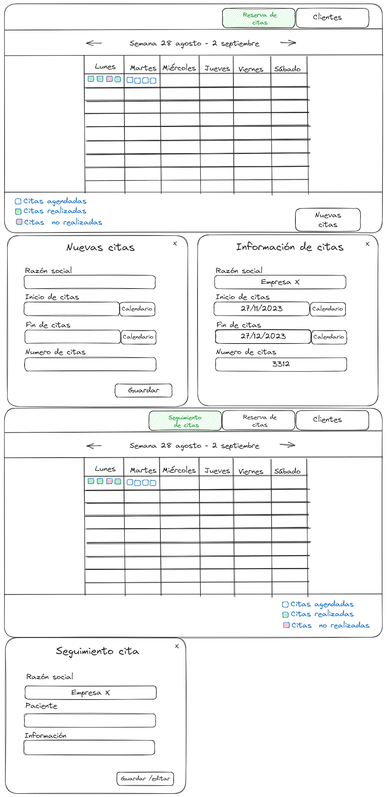

# Gestión de citas

Ultima actualización:

# Contenido

- Objetivo
- Background
- Detalles de diseño
  - Solución
    - Frontend
    - Backend

# Objetivo

- Creación de un CRUD para la gestión de las citas
- Sistema de reserva de citas
- Sistema de seguimiento de citas

## Background

Este feature tiene dos partes, una para la persona encargada de las reservas de las citas y otra para el seguimiento de las citas medicas.

## Solución

### Frontend

### Destalle del diseño



### Componente semana

Un calendario de lunes a sábado donde pondremos ver que citas tenemos agendadas y las que se han realizado y las que no con divido en el horario posible de las citas desde las 9 am hasta las 2 am y de 4 pm a 8 pm. Con una paginación por semanas.

### Reserva de citas

Un componente que aparece con la darle al botón de nuevas citas con la información necesaria para agendar la cita, razón social, periodo de tiempo de las citas y numero de citas, al guardar se hace un post para guardar las citas, debería recibir el nuevo estado de las citas y hacer render con las nuevas citas.

### Componente de las citas

Un cuadro parecido a un checkbox con tres estados posibles, vació para indicar que es una cita agendada, rellena con verde quiere decir que la cita ya se ha realizado y la rellena de rojo para las citas no realizadas se pone rojo si ya paso la fecha y no tiene paciente registrado.

### Información de las citas

Al darle click a los cuadrados nos aparece el componente con la información donde esta la información que se tomo al momento de la citas.

### Pagina seguimiento de citas

Tiene los mismo componentes de la reserva de cita pero al darle click a la cita se abre el componente de seguimiento de citas donde se agrega el nombre del paciente e información adicional, donde se puede editar estos campos.

### Backend

Para la gestión de las citas y las reservas se crean un modelo de datos para cada uno y un gestor de citas para asignar la hora de las citas y donde se obtienen las citas para mostrar en el Frontend

#### Modelo de datos de la reserva de cita

```python
# models.py
from django.db import models

class ReservaCita(models.Model):
    razon_social = models.ForeignKey("Empresa", on_delete = models.CASCADE)
    fecha_inicio_agenda = models.DateField(verbose_name ="inicio de citas")
    fecha_final_agenda = models.DateField(verbose_name ="final de citas")
    numero_citas = models.IntegerField()
    fecha_cita = models.DateField(verbose_name ="final del contrato")
    paciente= models.CharField(max_length=50)
    informacion = models.CharField( max_length=50)

```

### Modelo de datos de las citas

```python
# models.py
from django.db import models

class Cita(models.Model):
    razon_social = models.ForeignKey("Empresa", on_delete = models.CASCADE)
    numero_cita = models.CharField()
    fecha_cita = models.DateTimeField()
    paciente= models.CharField(max_length=50)
    informacion = models.CharField( max_length=50)

    object = CitaManager()
```

### Administrador de citas

Mira la ultima cita que hay en la base de datos para empezar a crear citas cada 20 minutos en un horario de 9 a 2 y de 4 a 8

```python
# citaManager.py
from django.db import models
from datetime import timedelta
NUMERO_DOCTORES = 4
class CitaManager(models.Manager):
    def nuevas_citas(self, inicio, final, razon_social, num_citas):
        last_cita = self.get_last_cita()
        hora_inicio, hora_fin_dia, hora_inicio_tarde, hora_fin_tarde = self.get_hours(inicio, last_cita)

        citas_creadas = 0

        while citas_creadas < num_citas:
            if hora_inicio <= hora_fin_dia:
                self.create_cita(razon_social, hora_inicio)
                citas_creadas += NUMERO_DOCTORES
                hora_inicio += timedelta(minutes=20)
            elif hora_inicio_tarde <= hora_fin_tarde:
                self.create_cita(razon_social, hora_inicio_tarde)
                citas_creadas += NUMERO_DOCTORES
                hora_inicio_tarde += timedelta(minutes=20)
            else:
                hora_inicio, hora_fin_dia, hora_inicio_tarde, hora_fin_tarde = self.get_next_day_hours(hora_inicio)

    def get_last_cita(self, razon_social):
      return self.order_by('-fecha_cita').first()

    def get_hours(self, inicio, last_cita):
        hora_inicio = last_cita.fecha_cita + timedelta(minutes=20) if last_cita else inicio.replace(hour=9, minute=0)
        hora_fin_dia = inicio.replace(hour=14, minute=0)
        hora_inicio_tarde = inicio.replace(hour=16, minute=0)
        hora_fin_tarde = inicio.replace(hour=20, minute=0)
        return hora_inicio, hora_fin_dia, hora_inicio_tarde, hora_fin_tarde

    def get_next_day_hours(self, hora_inicio):
        hora_inicio = hora_inicio.replace(day=hora_inicio.day + 1, hour=9, minute=0)
        hora_fin_dia = hora_inicio.replace(hour=14, minute=0)
        hora_inicio_tarde = hora_inicio.replace(hour=16, minute=0)
        hora_fin_tarde = hora_inicio.replace(hour=20, minute=0)
        return hora_inicio, hora_fin_dia, hora_inicio_tarde, hora_fin_tarde

    def create_cita(self, razon_social, fecha_cita):
      for _ in range(NUMERO_DOCTORES):
        self.create(
            razon_social=razon_social,
            numero_cita=f'',
            fecha_cita=fecha_cita,
            paciente='',
            informacion=''
        )

```

### API de Crear citas

Recibe la razón social, la fecha de inicio de las citas, la fecha final de las citas y el numero de citas donde el administrado de citas guarda las citas

```python
#views.py
# views.py
from rest_framework.views import APIView
from rest_framework.response import Response
from rest_framework import status
from .models import Cita
from .serializers import CrearCitaSerializer
from .citaManager import CitaManager

class CrearCita(APIView):
    def post(self, request, format=None):
        serializer = CrearCitaSerializer(data=request.data)
        if serializer.is_valid():
            cita_manager = CitaManager()
            inicio = serializer.validated_data['fecha_inicio_agenda']
            final = serializer.validated_data['fecha_final_agenda']
            razon_social = serializer.validated_data['razon_social']
            citas = serializer.validated_data['numero_citas']
            cita_manager.nuevas_citas(inicio, final, razon_social, citas)
            return Response(status=status.HTTP_201_CREATED)
        return Response(serializer.errors, status=status.HTTP_400_BAD_REQUEST)

```

### API de citas

Devuelve las citas de la semana del año que se le pida, recibe como parámetro el numero de la semana de año y devuelve las citas de esa semana

```python
from rest_framework import generics
from django.db.models import F
from django.db.models.functions import ExtractWeek
from datetime import datetime
from .models import Cita
from .serializers import CitaSerializer

class CitasSemanalesView(generics.ListAPIView):
    serializer_class = CitaSerializer

    def get_queryset(self):
        week_param = self.request.query_params.get('week')

        if week_param:
            try:
                week = int(week_param)
            except ValueError:
                return Cita.objects.none()
            # Filtra las citas por el número de semana proporcionado
            citas_semana = Cita.objects.annotate(week=ExtractWeek('fecha_cita')).filter(week=week)
        else:
            today = datetime.now()

            # Obtén la semana actual del año
            current_week = today.isocalendar()[1]
            # Filtra las citas por la semana actual
            citas_semana = Cita.objects.annotate(week=ExtractWeek('fecha_cita')).filter(week=current_week)

        return citas_semana


```
