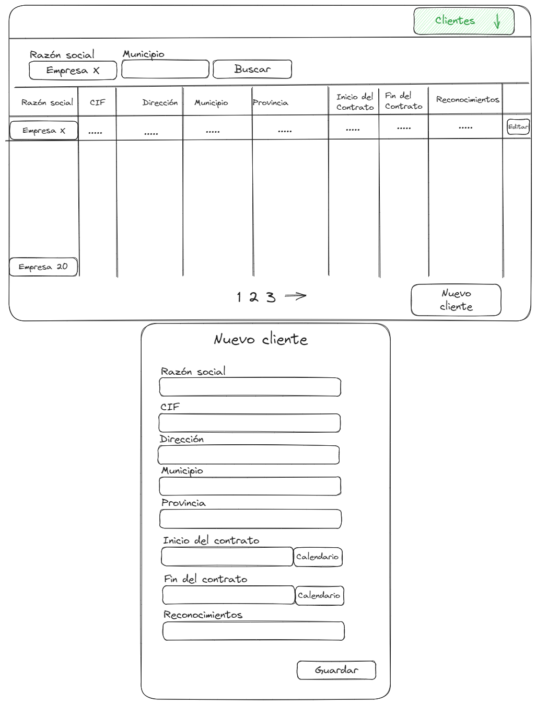

# Gestión de clientes

Ultima actualización: 28/08/2023

## Contenido

- Objetivo
- Background
- Detalles de diseño
  - Solución
    - Frontend
    - Backend

## Objetivo

- Creación de un CRUD para la gestión de los clientes
- Implementación de las tablas de clientes en la base de datos
- Interfaz donde se pueden podrán filtrar por razón social y municipios.

## Background

Es el feature de la gestión de clientes para una aplicación de gestión de citas para un centro que realiza reconocimientos de empresas que son los clientes.

## Solución

### Frontend

#### Detalle del diseño



### Botón cliente en el nav

Creación del botón en el nav bar para ir a la pagina de cliente

### Pagina de cliente

#### FILTRO

Un input para razón social y municipio con un botón de buscar, el botón manda un get al backend con la información de los inputs, si es exitoso se muestra en la tabla la información si no se muestra que no se encontraron datos

#### TABLA

Columna por cada dato del usuario mas un botón de editar que nos permite modificar lo que quiere decir que los rows son inputs que nos permiten hacer las modificaciones correspondientes.

Tiene pagination de 20 resultados por pagina en el caso de la razón social no importa ya que solo habrá un resultado, pero en municipio si existen muchas empresas por municipio y para no cargar todos los datos se hace la pagination

#### Componente Nuevo cliente

Un componente emergente que sale al darle al botón de nuevo cliente con un form que pide los datos del cliente, al guardar hace un post y muestra el cliente en la tabla

### Backend

#### Creación den ORM

Un modelo en Django con los datos del usuario

```python
# models.py
from django.db import models

class Empresa(models.Model):
    razon_social = models.CharField("razón social",max_length=100)
    municipio = models.CharField("municipio",max_length=50)
    cif = models.CharField("CIF", max_length=50)
    direccion = models.CharField("dirección",max_length=50)
    provincia = models.CharField("provincia",max_length=50)
    inicio_controato = models.DateField(verbose_name = "inicio del contrato")
    fin_controato = models.DateField(verbose_name ="final del contrato")
    reconocimientos = models.IntegerField(verbose_name ="reconocimientos contratados")

    def __str__(self):
        return self.razon_social

```

#### Creación de la API clientes

Una API CRUD con filtrado en el get con los campos "razon_social" y "municipio"

```python
# views.py
from rest_framework import generics
from .models import Empresa
from .serializers import EmpresaSerializer

class EmpresaList(generics.ListCreateAPIView):
    queryset = Empresa.objects.all()
    serializer_class = EmpresaSerializer
    pagination_class = CustomPagination
    def get_queryset(self):
        queryset = super().get_queryset()
        razon_social = self.kwargs.get('razon_social')
        municipio = self.kwargs.get('municipio')

        if razon_social:
            queryset = queryset.filter(razon_social__icontains=razon_social)

        if municipio:
            queryset = queryset.filter(municipio__icontains=municipio)

        return queryset

```

#### URL

```python
#urls
from django.urls import path
from .views import EmpresaList, EmpresaDetail

urlpatterns = [
    path('api/clientes/', EmpresaList.as_view(), name='empresa-list'),
    path('api/clientes/<int:pk>/', EmpresaDetail.as_view(), name='empresa-detail'),
]

```

#### Paginacion

```python
class CustomPagination(PageNumberPagination):
    page_size = 20
    page_size_query_param = 'page_size'
    max_page_size = 100

```
